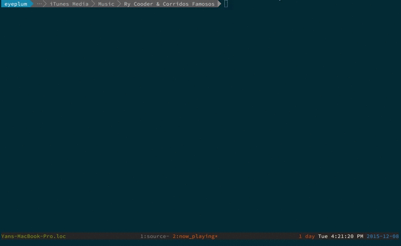

# RyCooder
Simple command line music player written in Swift.



## Deployment Target

RyCooder supports __OS X 10.9 and Later__

## How to install RyCooder

If you have __Xcode 7.0 or above__ installed, and you are using the Xcode version of Swift 2.x, you can build RyCooder yourself. 
If not, you can download a pre-compiled binary.

### Build RyCooder yourself

```
git clone git@github.com:Codezerker/RyCooder.git
cd RyCooder
./install
```

### Use pre-compiled versions

You can download pre-compiled binaries [here](https://github.com/Codezerker/RyCooder/releases).

## How to use RyCooder

You can listen to your favorite music in command line by simply run `rycooder` in the folder that contains music files.

```
cd /Path/To/Music/Files
rycooder
```

When you run `rycooder` in a folder, it will add all the music files founded in the current folder and all its subfolders to the playing queue. 

RyCooder regards only `.mp3`, `.m4a` and `.m4p` files as _music files_ currently.

## TODO

- Parse iTunes music library
- Support more audio formats
- Use the latest open source Swift toolchain

